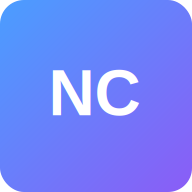

# Nexus Canvas - Creative Workspace Suite



**Nexus Canvas** is a comprehensive, browser-based creative workspace suite that provides professional-grade tools for web development, image editing, video editing, screen recording, and productivity tasks. Built entirely with HTML, CSS, and JavaScript, it operates completely client-side with no external API dependencies.

## 🌟 Features

### 🌐 Web Creator Studio
- **Drag-and-drop website builder** with visual components
- **Real-time property editing** with intuitive GUI controls
- **Multi-device preview** (Desktop, Tablet, Mobile)
- **Component library** with pre-built UI elements
- **Live export** to clean HTML/CSS/JavaScript
- **PWA-ready** with offline functionality

### 💻 Code Studio
- **Advanced code editor** with syntax highlighting
- **Live preview** with real-time updates
- **File management** system with project organization
- **Multi-language support** (HTML, CSS, JavaScript, JSON, Markdown)
- **Code formatting** and basic auto-completion
- **Project export** with File System Access API

### 🖼️ Image Studio
- **Professional image editing** with layers support
- **Drawing tools** (Brush, Eraser, Shapes, Text)
- **Image adjustments** (Brightness, Contrast, Saturation)
- **Non-destructive editing** with history management
- **Multiple file format support** (PNG, JPG, WebP)
- **Canvas-based rendering** for high performance

### 🎬 Video Studio
- **Timeline-based video editing** with multiple tracks
- **Media library** for asset management
- **Effects and transitions** with real-time preview
- **Audio and video synchronization**
- **Export capabilities** using WebCodecs API
- **Drag-and-drop workflow** for intuitive editing

### 📹 Screen Recorder
- **Screen, window, or tab recording** with audio capture
- **Configurable quality settings** (Resolution, Frame rate, Bitrate)
- **Real-time recording controls** (Start, Pause, Stop)
- **Local storage** of recordings with playback
- **Multiple format support** (WebM, MP4)
- **Privacy-focused** with no external uploads

### 📊 Productivity Suite
- **Document Editor** (Word-like) with rich text formatting
- **Spreadsheet Editor** (Excel-like) with formulas and calculations
- **Presentation Builder** (PowerPoint-like) with slides and animations
- **Export capabilities** to standard formats
- **Collaborative features** for team productivity

## 🚀 Getting Started

### Prerequisites
- Modern web browser with support for:
  - ES6+ JavaScript
  - Canvas API
  - IndexedDB
  - File System Access API (optional, for enhanced file operations)
  - MediaRecorder API (for screen recording)
  - WebCodecs API (optional, for advanced video processing)

### Installation

1. **Clone the repository:**
   ```bash
   git clone https://github.com/your-username/nexus-canvas.git
   cd nexus-canvas
   ```

2. **Serve the files:**
   ```bash
   # Using Python
   python -m http.server 8000
   
   # Using Node.js
   npx serve .
   
   # Using PHP
   php -S localhost:8000
   ```

3. **Open in browser:**
   Navigate to `http://localhost:8000`

### PWA Installation
- Visit the application in a modern browser
- Look for the "Install" prompt or use the browser's install option
- The app will be available offline and can be launched like a native application

## 🏗️ Architecture

### Core Technologies
- **HTML5** - Semantic structure and modern web standards
- **CSS3** - Advanced styling with Flexbox, Grid, and custom properties
- **JavaScript (ES6+)** - Modern JavaScript with modules and async/await
- **Web APIs** - Extensive use of browser APIs for native-like functionality

### Design Philosophy
- **Client-side first** - No server dependencies or external APIs
- **Privacy-focused** - All data stays on the user's device
- **Performance-optimized** - Efficient rendering and memory management
- **Accessibility-compliant** - WCAG guidelines and keyboard navigation
- **Mobile-responsive** - Adaptive design for all screen sizes

### File Structure
```
nexus-canvas/
├── index.html              # Main application entry point
├── manifest.json           # PWA manifest
├── sw.js                   # Service Worker for offline functionality
├── styles/
│   ├── main.css            # Core styles and CSS variables
│   ├── components.css      # Reusable component styles
│   └── studios.css         # Studio-specific styles
├── scripts/
│   ├── core/
│   │   ├── app.js          # Main application controller
│   │   ├── storage.js      # IndexedDB storage manager
│   │   └── utils.js        # Utility functions and helpers
│   └── studios/
│       ├── web-creator.js  # Web Creator Studio
│       ├── code-editor.js  # Code Studio
│       ├── image-editor.js # Image Studio
│       ├── video-editor.js # Video Studio
│       ├── screen-recorder.js # Screen Recorder
│       └── productivity.js # Productivity Suite
└── assets/
    └── icons/              # PWA icons and assets
```

## 🎨 Design System

### Color Palette
- **Primary Background:** `#0a0a0f` (Deep dark)
- **Secondary Background:** `#1a1a2e` (Dark blue-gray)
- **Accent Colors:** Blue (`#4a9eff`), Purple (`#8b5cf6`), Green (`#10b981`)
- **Text Colors:** Primary (`#ffffff`), Secondary (`#b8b8b8`), Muted (`#888888`)

### Typography
- **Primary Font:** Noto Sans JP (Japanese support)
- **Secondary Font:** Inter (Latin characters)
- **Monospace Font:** Monaco, Menlo, Ubuntu Mono (Code editing)

### UI Components
- **Glassmorphism effects** with backdrop-filter
- **Rounded corners** (2xl radius for modern look)
- **Smooth animations** with CSS transitions
- **Consistent spacing** using CSS custom properties

## 🔧 Development

### Adding New Features
1. Create feature branch: `git checkout -b feature/new-feature`
2. Implement changes following the existing architecture
3. Test across different browsers and devices
4. Update documentation and examples
5. Submit pull request with detailed description

### Code Style Guidelines
- Use ES6+ features and modern JavaScript patterns
- Follow consistent naming conventions (camelCase for variables, PascalCase for classes)
- Write self-documenting code with minimal comments
- Use CSS custom properties for theming and consistency
- Implement proper error handling and user feedback

### Testing
- Test in multiple browsers (Chrome, Firefox, Safari, Edge)
- Verify PWA functionality and offline capabilities
- Test responsive design on various screen sizes
- Validate accessibility with screen readers and keyboard navigation
- Performance testing with large files and complex projects

## 📱 Browser Support

### Fully Supported
- **Chrome 90+** - All features including WebCodecs
- **Firefox 88+** - Most features (WebCodecs limited)
- **Safari 14+** - Core features with some limitations
- **Edge 90+** - Full feature support

### Partially Supported
- **Mobile browsers** - Core functionality with touch adaptations
- **Older browsers** - Graceful degradation with feature detection

## 🤝 Contributing

We welcome contributions from the community! Please read our [Contributing Guidelines](CONTRIBUTING.md) for details on:

- Code of conduct
- Development setup
- Pull request process
- Issue reporting
- Feature requests

## 📄 License

This project is licensed under the MIT License - see the [LICENSE](LICENSE) file for details.

## 🙏 Acknowledgments

- **Web Standards Community** for advancing browser capabilities
- **Open Source Contributors** for inspiration and code examples
- **Design Community** for UI/UX best practices
- **Accessibility Advocates** for inclusive design principles

## 🔗 Links

- **Live Demo:** [https://nexus-canvas.demo.com](https://nexus-canvas.demo.com)
- **Documentation:** [https://docs.nexus-canvas.com](https://docs.nexus-canvas.com)
- **Issue Tracker:** [GitHub Issues](https://github.com/your-username/nexus-canvas/issues)
- **Discussions:** [GitHub Discussions](https://github.com/your-username/nexus-canvas/discussions)

## 📊 Project Status

- **Version:** 1.0.0
- **Status:** Active Development
- **Last Updated:** May 2025
- **Maintainers:** Aro Software Group

---

**Built with ❤️ using only HTML, CSS, and JavaScript**

*Nexus Canvas - Where creativity meets technology, completely in your browser.*